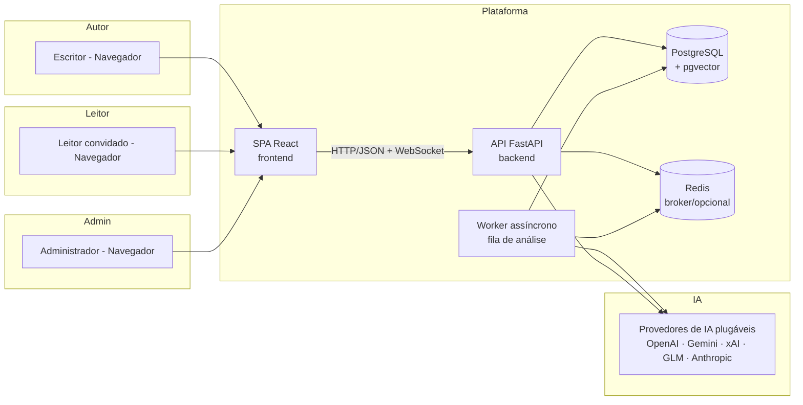

# Architecture — Visão de alto nível

> Documento público com a arquitetura em **nível 1** (contexto de sistema). Detalhes de implementação
> interna são mantidos em repositório privado.

## Visão geral

A plataforma é um sistema **web full-stack** com backend em camadas, fila assíncrona opcional e uma
**camada de IA plugável**. O autor interage por uma SPA; um leitor externo pode acessar obras
compartilhadas sem autenticação.

## Diagrama de contexto

## Componentes

| Componente | Papel |
|---|---|
| **SPA React** | Editor, visualizações (grafo, timeline, curva de tensão), painel admin, leitor público. Consome a API via HTTP. |
| **API FastAPI** | Regras de negócio, autenticação/autorização, orquestração da análise, endpoints REST. |
| **Worker assíncrono** | Executa as análises pesadas (extração de entidades, relações, consistência, insights) fora do ciclo de resposta HTTP. Se a fila não estiver configurada, a análise roda de forma síncrona. |
| **PostgreSQL + pgvector** | Persistência de todos os dados da obra e do conhecimento narrativo. |
| **Redis** | Broker da fila assíncrona (opcional). |
| **Camada de IA plugável** | Abstrai provedores de LLM. A escolha do provedor é configurável; prompts podem ser customizados por projeto. |

## Fluxo de dados (alto nível)

1. O autor **salva um capítulo** no editor (autosave).
2. O autor (ou o sistema) **dispara a análise** daquele capítulo.
3. A análise processa **apenas o novo conteúdo** (incremental) e reconcilia com o estado anterior.
4. O conhecimento extraído é **persistido** (entidades, relações, menções, cenas, fatos, promessas, voz).
5. As visualizações e a margem viva **leem esse conhecimento** e o apresentam ao autor no momento certo.
6. O leitor convidado acessa apenas o que foi **autorizado e sem spoilers** (codex com teto de capítulo).

## Notas

- **Incremental por design:** a análise não reprocessa a obra inteira a cada salva.
- **O autor manda:** toda sugestão passa por aceite; a plataforma nunca altera o texto por conta própria.
- **Privacidade:** a arquitetura suporta IA local; provedores remotos são opcionais e configuráveis.
- **Implantações:** Docker Compose para desenvolvimento e produção; o backend serve o frontend via Nginx em produção.

## O que não está neste documento

- Detalhes dos **modelos de dados** internos;
- **Engenharia de prompts** e motores de extração/consistência/assistência;
- Estratégia de segurança detalhada e decisões técnicas registradas (ADRs).

Esses materiais são mantidos privados por se tratarem do diferencial técnico do projeto.