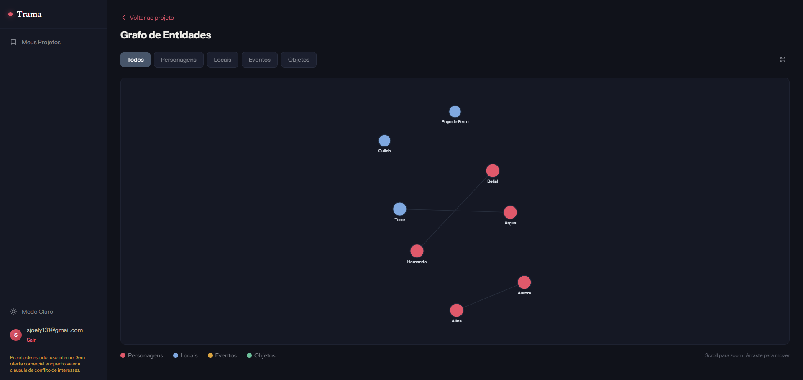
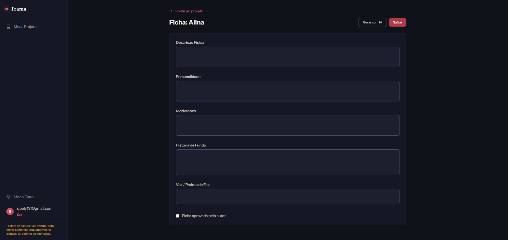
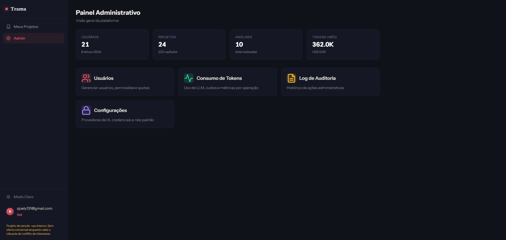

# Features — Tour completo do que foi construído

> As capturas de tela ficam em `assets/screenshots/`. Os nomes citados abaixo são os arquivos esperados.

## 1. Escrita

### Editor de capítulo com "margem viva"

O editor é o coração da experiência. O autor escreve com autosave e contagem de palavras. Na lateral,
a **margem viva** reage ao texto: quando o cursor toca uma entidade já conhecida, a página mostra o
**contexto naquele momento da história** — ficha da personagem, traços de voz, promessas em aberto,
últimas menções e relações — **sem estragar spoilers** (o contexto respeita até que capítulo aquilo
deveria ser conhecido).

- Dicas de voz da personagem enquanto escreve.
- Comentários ancorados em trechos do texto.
- Histórico de **versões** com diff entre edições.

### Cenas
Cada capítulo pode ser quebrado em **cenas**, com participantes, objetivo, conflito, local e POV.

## 2. Análise narrativa

### Grafo de conhecimento

Mapa interativo de personagens, locais, eventos e objetos, com **relações ponderadas** (familiar,
romântica, de poder, amizade...) e evolução temporal. Filtros por tipo de relação e corte por capítulo
(`até aqui a história tinha isso`).

### Linhagem e causalidade
- **Linhagem/genealogia** de personagens.
- **Grafo causal**: eventos conectados por causa → efeito.

### Timeline
Linha do tempo das entidades capítulo a capítulo.

### Ficha de personagem

Física, personalidade, motivações, **voz** e traços. A análise propõe; o autor **aprova** cada campo.
A IA também constrói um **perfil de voz** e alerta quando um personagem fala "fora do personagem".

### Regras de mundo
Regras definidas pelo autor + detecção de **violações**.

## 3. Consistência e memória narrativa

### Livro de promessas
Juramentos, dívidas, mentiras, segredos, **armas de Chekhov** e profecias — com status
aberto/cumprida/quebrada/abandonada. A IA **sincroniza** promessas novas a partir da análise dos capítulos.

### Quem sabe o quê

Fatos secretos rastreados por personagem e capítulo: quem conhece cada fato, quando aprendeu, e se há
**vazamentos** (alguém agindo como se soubesse antes de saber). Inclui checagem de **fair-play** de
pistas (o leitor tinha como descobrir antes da revelação?).

### Raio de impacto e renomear

Simule a **remoção** de uma entidade ou evento e veja um mapa de calor dos capítulos afetados. E, sem
quebrar a obra, **renomeie** uma personagem com preview das consequências e registro em versões.

## 4. Análise dramática

### Curva de tensão

Insights dramáticos e a **curva de tensão prevista × real** por capítulo. A **leitura instrumentada**
(com consentimento explícito e sessão anônima) compara como a história foi projetada com como ela é
realmente percebida.

### Estatísticas e recapitulação
Métricas de escrita (palavras, capítulos) e **recapitulação gerada por IA** do que já foi publicado.

## 5. Escrita assistida

Sugestões com **aceite/rejeição** e **diff inline ou lado a lado**:
- Continuar a partir do ponto atual;
- Melhorar um trecho selecionado;
- Próximo passo da trama;
- **"E se..."** (variações de desdobramento);
- **Leitor beta** (leitura crítica simulada);
- Sinopse da obra por IA.

> **Por design, a plataforma não gera capítulos inteiros.** O assistente apoia decisões; a história é do autor.

## 6. Colaboração e publicação

### Compartilhamento
- Links de leitura pública de uma obra (com **revogação** a qualquer momento);
- **Codex público** — mundo, personagens e fatos expostos **sem spoilers** (teto de capítulo), com
  candidatas **aprovadas pelo autor**;
- Comentários ancorados e versões para coautoria e revisão.

### Exportação
Exportação da obra em formato de arquivo (download direto).

### Importação de manuscrito

Traga um arquivo existente (**docx/epub/md**) e o sistema divide em capítulos com preview, permite
manter/juntar/descartar partes e roda a análise completa automaticamente, com auditoria do processo.

## 7. Administração e plataforma

Painel completo para quem opera a plataforma:
- Gestão de **usuários** (ativação, cotas de projetos/tokens/análises);
- **Permissões dinâmicas** por papel, com ajustes por usuário;
- Métricas de uso: tokens e custo estimado por operação e por usuário;
- **Trilha de auditoria** de ações administrativas;
- Configurações de plataforma (valores sensíveis mascarados).

## 8. Segurança

- Autenticação com **JWT de curto prazo + refresh rotativo**, detecção de reutilização e revogação de sessão;
- Senhas com **Argon2**;
- **Rate limiting** em rotas sensíveis (login, registro, leitura pública);
- Autorização **server-side por permissão** (deny by default);
- Pipeline de segurança em CI: detecção de segredos, análise estática, verificação de dependências e teste dinâmico.